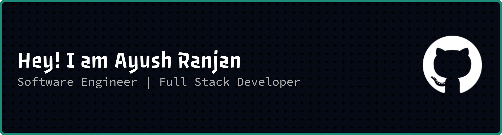

### 🎓 B.Tech EEE @ VIT Vellore  

# 💫 About Me:
🧑‍💻Passionate about Software Development, AI/ML, and Full Stack Development 🤝Love building projects, solving DSA problems, and exploring modern technologies 🏋️Currently focused on becoming an industry-ready developer 🔍Interested in scalable systems, finance, trading, and blockchain 💫Always learning, building, and improving every day

## 🔗 Connect With Me

# 🛠️ Tech Stack

### Languages

### Backend & APIs

### Frontend

### Databases & Cloud

### AI / ML & GenAI

 

### Tools & Specializations

 

## 📊 GitHub Stats

&nbsp;&nbsp;

---

## 📈 Activity Graph

---

## 🐍 Contributions

### ✍️ Random Dev Quote

  

---

**Keep building. Keep learning.**

